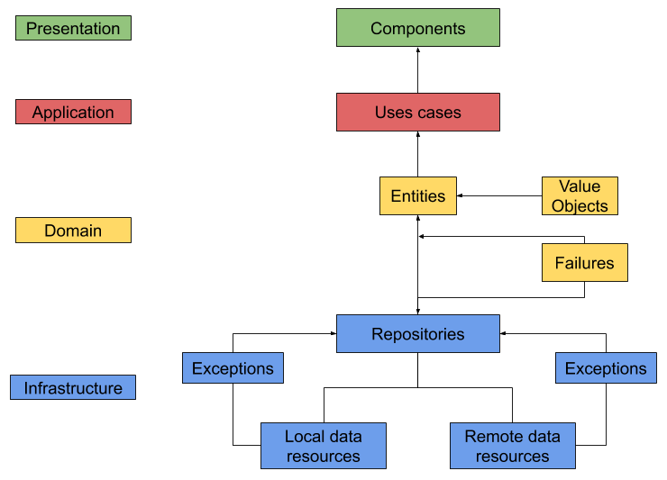

### React Native Clean architecture

### Project Structure

```
/
├── ios						     iOS Native Code. 
├── android				          Android Native Code.
├── tests				               Unit tests.
├── e2e				               Tests e2e.
└── src
     ├── bounded-context                
     │      ├── presentation            React Native UI logic, containers, screens, components.
     │      │       ├── components      
     │      │       └── stylesheets     
     │      ├── application             Application business logic (Use cases).
     │      ├── domain                  Enterprise business logic.
     │      │       ├── entity          
     │      │       ├── failures        
     │      │       └── value-object    
     │      └── infrastructure          Interface to communicate with other contexts. (Local and remote resources)
     │          ├── sagas
     │          ├── services
     │          └── redux
     └── shared                         
```

### Project Architecture - Applying Clean Architecture in React Native

The rule of dependency can help you to intelligently divide and conquer, using concepts from [**Clean Architecture**](https://blog.cleancoder.com/uncle-bob/2012/08/13/the-clean-architecture.html) We can build apps more stables and more scalable.

Separate the application in **bounded contexts**, you can think in this like a **module** and communicate the different bounded contexts thought interfaces by this way we have more possibilities to scale the application if we need in a future.

In this case this can be a great idea to abstract the business logic and uses cases from the UI (react native code), to get that we will use **layers**:

1. Presentation.
2. Use cases.
3. Domain.
4. Infrastructure.



#### Presentation

In this layer are all the react native code, in less words the view. (components, styles, routing, theme...)

#### Application

In this layer we place the **Use cases**, this interact with the **Domain** layer and know about the **Entities** that each **Use case** need to do a specific task. This layer encapsulate the application logic and orchestrate the flow of data.

#### Domain

The domain encapsulate:

1. **Entities**
2. **Value objects**
3. **Failures**

**Entities** encapsulate Enterprise wide business rules. An entity can be an object with methods, or it can be a set of data structures and functions.

**Value objects** is used to model concepts in our system, such as identifiers, dates or date ranges, prices, weights, speeds (virtually any magnitude is modelable as a used-vehicle), or even titles, names or addresses. Entities, for example, are composed of Value Objects.

**Failures** is a abstraction layer to handle the exceptions from the repository/infrastructure layer.

#### Infrastructure

Here live the repositories, local and remote resources as services. (Store, API connections, LocalStorage, device resources like location, etc)

